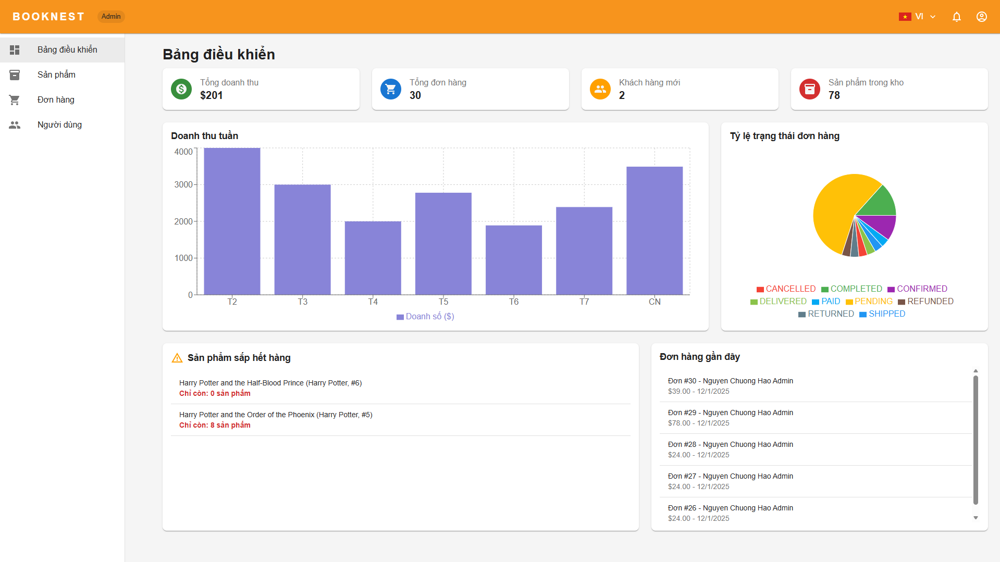

# BookNest - Nền tảng Thương mại điện tử cho Sách

Chào mừng bạn đến với BookNest! Đây là một dự án ứng dụng web thương mại điện tử được xây dựng bằng React, chuyên cung cấp một nền tảng để mua bán sách trực tuyến.




## 📚 Giới thiệu

BookNest là một hiệu sách trực tuyến hiện đại, nơi người dùng có thể khám phá, tìm kiếm và mua những cuốn sách yêu thích. Dự án được thiết kế với hai giao diện chính: một cho khách hàng mua sắm và một cho quản trị viên để quản lý sản phẩm, đơn hàng và người dùng.

## ✨ Tính năng chính

Dự án bao gồm một loạt các tính năng cần thiết cho một trang web thương mại điện tử hoàn chỉnh.

### Giao diện người dùng (Khách hàng)

*   **Trang chủ:** Hiển thị sách nổi bật, các danh mục và banner quảng cáo.
*   **Tìm kiếm & Lọc:** Chức năng tìm kiếm mạnh mẽ để tìm sách theo tên, tác giả, v.v.
*   **Trang sản phẩm:** Xem chi tiết thông tin sách, bao gồm mô tả, tác giả, nhà xuất bản, số trang, ISBN, đánh giá của người dùng.
*   **Giỏ hàng:** Thêm/xóa sản phẩm, cập nhật số lượng, và xem tóm tắt đơn hàng.
*   **Thanh toán:** Quy trình thanh toán đơn giản với thông tin giao hàng và lựa chọn phương thức thanh toán (COD, PayPal).
*   **Quản lý tài khoản:** Người dùng có thể xem và cập nhật thông tin cá nhân, địa chỉ, và xem lại lịch sử đơn hàng.
*   **Xác thực:** Đăng ký, đăng nhập và đăng xuất.
*   **Đa ngôn ngữ:** Hỗ trợ tiếng Việt và có thể mở rộng cho các ngôn ngữ khác.

### Giao diện quản trị (Admin)

*   **Bảng điều khiển (Dashboard):** Cung cấp cái nhìn tổng quan về các chỉ số kinh doanh quan trọng như tổng doanh thu, tổng đơn hàng, khách hàng mới và số lượng sản phẩm trong kho. Biểu đồ trực quan hóa doanh thu theo tuần.
*   **Quản lý Sản phẩm:** Thêm, sửa, xóa sách và quản lý thông tin chi tiết.
*   **Quản lý Đơn hàng:** Xem danh sách các đơn hàng, cập nhật trạng thái (ví dụ: đang xử lý, đã giao).
*   **Quản lý Người dùng:** Xem danh sách người dùng và quản lý vai trò của họ.

## 🚀 Công nghệ sử dụng

Dự án này được xây dựng bằng các công nghệ web hiện đại để đảm bảo hiệu suất và trải nghiệm người dùng tốt nhất.

*   **Frontend:**
    *   **Framework:** [React.js](https://reactjs.org/)
    *   **UI Library:** [Material-UI (MUI)](https://mui.com/) - Để xây dựng giao diện người dùng đẹp và nhất quán.
    *   **Routing:** [React Router](https://reactrouter.com/) - Để điều hướng giữa các trang.
    *   **Biểu đồ:** [Recharts](https://recharts.org/) - Để hiển thị các biểu đồ dữ liệu trên trang dashboard.
    *   **Quản lý trạng thái:** React Hooks (`useState`, `useEffect`, `useContext`).
    *   **Đa ngôn ngữ (i18n):** i18next - Để hỗ trợ nhiều ngôn ngữ.
*   **Backend (Dự kiến):**
    *   Node.js với Express.js hoặc một framework tương tự.
    *   Cơ sở dữ liệu SQL (PostgreSQL, MySQL) hoặc NoSQL (MongoDB).
    *   API RESTful để giao tiếp giữa frontend và backend.

## 🛠️ Cài đặt và Chạy dự án

Để chạy dự án này trên máy cục bộ của bạn, hãy làm theo các bước sau:

1.  **Clone repository:**
    ```bash
    git clone <URL_CUA_REPOSITORY>
    cd booknest/frontend
    ```

2.  **Cài đặt các dependencies:**
    Sử dụng `npm` hoặc `yarn`.
    ```bash
    npm install
    ```
    hoặc
    ```bash
    yarn install
    ```

3.  **Chạy ứng dụng:**
    ```bash
    npm start
    ```
    Ứng dụng sẽ chạy ở chế độ phát triển. Mở http://localhost:3000 để xem trong trình duyệt.

## 🤝 Đóng góp

Chúng tôi hoan nghênh mọi sự đóng góp! Nếu bạn muốn đóng góp cho dự án, vui lòng fork repository và tạo một Pull Request.

1.  Fork dự án.
2.  Tạo một branch mới (`git checkout -b feature/AmazingFeature`).
3.  Commit các thay đổi của bạn (`git commit -m 'Add some AmazingFeature'`).
4.  Push lên branch (`git push origin feature/AmazingFeature`).
5.  Mở một Pull Request.

---
© 2025 BookNest. Đã đăng ký bản quyền.
